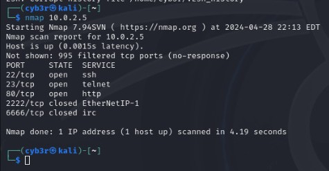
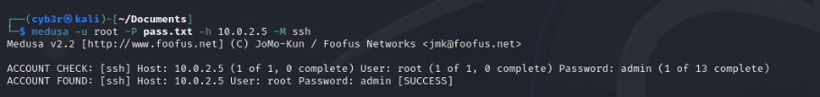
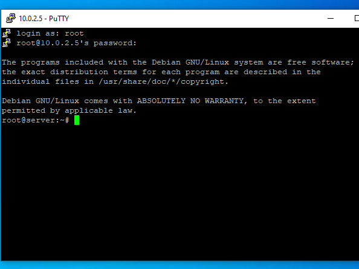
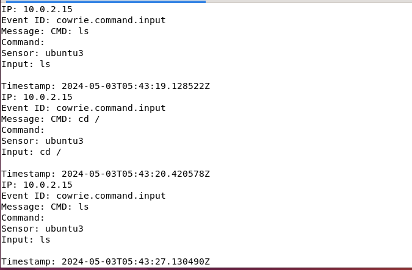
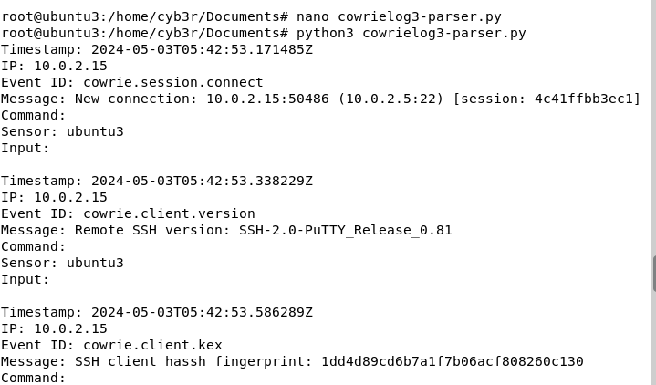
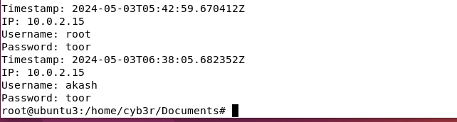

# Implementation and Analysis on Cowrie Honeypot

## Project Overview
This project focuses on deploying the Cowrie honeypot to study and mitigate SSH brute-force attacks. Cowrie, a medium-interaction honeypot, simulates SSH services to attract attackers, logs their interactions, and provides insights into their behaviors and tactics. The project also includes testing the honeypot using various tools and analyzing the collected data.

## Objectives
- Review existing research and honeypot solutions.
- Set up and configure Cowrie honeypot on Ubuntu Server.
- Simulate brute-force attacks using tools like Medusa and Metasploit.
- Analyze attacker behaviors, techniques, and tactics.
- Provide recommendations for proactive defense measures.

## Project Highlights
### Features of Cowrie Honeypot
- Simulates SSH services to attract attackers.
- Logs attacker interactions, including login attempts, executed commands, and file transfers.
- Provides JSON-formatted logs for detailed analysis.

### Tools and Technologies Used
#### Hardware
- **Lenovo T460s Laptop**: Used for hosting virtual environments.
- **VirtualBox**: Virtualization platform for running isolated Ubuntu Server and Kali Linux environments.

#### Software
- **Ubuntu Server 22.04 LTS**: Hosting platform for Cowrie honeypot.
- **Kali Linux 2024**: Used for penetration testing and launching attacks.
- **Putty**: Terminal emulator for testing SSH access.
- **Nmap**: Network scanning tool to detect open ports and services.
- **Medusa and Metasploit**: Brute-forcing tools for simulating attacks.

### Methodology
1. **Installing and Configuring Cowrie on Ubuntu Server**
   - Cowrie will be configured to listen for SSH connections on port 22. To avoid conflict with the real SSH service, the real SSH service will be reconfigured to listen on a different port for administrative purposes.

## Step 1: Modify SSH Configuration

1. Open the SSH configuration file:
    ```bash
    sudo nano /etc/ssh/sshd_config
    ```

2. Update the listening port for the SSH service to a different port (e.g., `2244`).

3. Restart the SSH service to apply changes:
    ```bash
    sudo systemctl restart ssh
    ```

4. Verify the SSH service status:
    ```bash
    sudo systemctl status ssh
    ```

5. Test the connection to the new SSH port:
    ```bash
    ssh root@<your-server-ip> -p 2244
    ```

## Step 2: Install Dependencies

1. Install the required dependencies for Cowrie:
   ```bash
   sudo apt-get update && sudo apt-get upgrade
   sudo apt-get install git python3-virtualenv libssl-dev libffi-dev build-essential libpython3-dev python3-minimal authbind virtualenv
   ```

## Step 3: Add a Cowrie User

1. Create a new user for Cowrie:
   ```bash
   sudo adduser --disabled-password cowrie
   ```

## Step 4: Clone the Cowrie Repository

1. Switch to the Cowrie user:
    ```bash
    sudo su - cowrie
    ```

2. Navigate to the user's home directory and clone the Cowrie repository:
    ```bash
    git clone https://github.com/cowrie/cowrie
    ```

## Step 5: Set Up the Virtual Environment

1. Navigate to the Cowrie directory:
    ```bash
    cd ~/cowrie
    ```

2. Create a Python virtual environment:
    ```bash
    python3 -m venv cowrie-env
    ```

3. Activate the virtual environment:
    ```bash
    source cowrie-env/bin/activate
    ```

4. Install the required Python packages:
    ```bash
    python -m pip install --upgrade pip
    python -m pip install --upgrade -r requirements.txt
    ```

## Step 6: Configure Cowrie

1. Copy the default configuration file and rename it:
    ```bash
    cp cowrie.cfg.dist cowrie.cfg
    ```

2. Edit the configuration file to customize the settings:
    ```bash
    nano cowrie.cfg
    ```
    Modify the hostname and other settings to make the server appear realistic.

## Step 7: Configure Port Redirection

 Cowrie must listen on port 22 for SSH connections. There are two methods to achieve this:

### Method 1: Using iptables

1. Redirect port 22 to Cowrie's default port (2222):
    ```bash
    sudo iptables -t nat -A PREROUTING -p tcp --dport 22 -j REDIRECT --to-port 2222
    ```

2. Ensure the real SSH service is running on a different port to avoid conflicts.

### Method 2: Using Authbind

1. Install Authbind:
    ```bash
    sudo apt-get install authbind
    ```

2. Allow Cowrie to bind to port 22:
    ```bash
    sudo touch /etc/authbind/byport/22
    sudo chown cowrie:cowrie /etc/authbind/byport/22
    sudo chmod 770 /etc/authbind/byport/22
    ```

3. Edit the Cowrie configuration to enable Authbind and update the listening port:
    ```bash
    nano cowrie.cfg
    ```
    Update the `[ssh]` section to:
    ```
    [ssh]
    listen_endpoints = tcp:22:interface=0.0.0.0
    ```

## Step 8: Start Cowrie

1. Navigate to the `bin` directory and start Cowrie:
   ```bash
   cd ~/cowrie/bin
   ./cowrie start
   ```

## Step 9: Customize Cowrie

1. Set up fake services, user credentials, and logging behavior to mimic legitimate services.

2. Create a fake file system using the `cowrie/honeyfs` directory for attackers to interact with:
    - `cowrie/honeyfs/etc/passwd`: Simulates user accounts.
    - `cowrie/share/cowrie/txtcmds/usr/bin`: Contains essential binary executables.
    - `cowrie/share/cowrie/txtcmds/usr/sbin`: Contains system administration utilities.

3. Ensure all configurations make the honeypot appear realistic to attackers.

---
This concludes the installation and configuration of Cowrie on an Ubuntu server. The honeypot is now ready to capture attacker interactions and provide valuable insights for security analysis.


2. **System Testing**
   - Testing scenario 1: Nmap Scanning
   Nmap is one of the tools that can be used in port scanning. nmap was use to run a port scan on the system, I used following command to scan the system on kali-linux “nmap ip-addr"
   

   - Testing scenario 2: Brute-force attack in Medusa
   In second phase, bruteforce attack was selected which is a hacking method that uses trial and error to crack passwords, login credentials and encryption keys. For this attack, a tool named medusa, which comes built-in in Kali Linux OS. Medusa works by using different approaches to perform brute force attacks in order to guess the right combination. Pen Testers commonly use it so that the weak links can be resolved. the following command was used to launch the attack “medusa -u root -p pass.txt -h ip-addr"
   
 
   - Testing scenario 3: Brute-force attack in Metasploit
   Also the attack was preform on metasploit , which comes built-in in Kali Linux OS. metasploit works by using different approaches to perform brute force attacks in order to guess the right combination. Pen Testers commonly use it so that the weak links can be resolved. the following command was used to launch the attack, setting the RHOSTS, PASS, VERBOSE, USERNAME.
   
   - Testing scenario 4: Testing using putty
   Testing the system using putty was used to gain accesss into the system and successfully got into the cowrie honeypot as root and using the password from bruteforcing.
   

3. **Data Collection and Analysis**
   - Developed a Python-based parsing tool to process Cowrie logs.
   - The log directory used by the parsing tool is:
   `/home/cowrie/cowrie/var/log/cowrie/`

### Usage
To use the parsing tool, follow these steps:
1. **Navigate to the Tool's Location:**
   Open a terminal and navigate to the directory containing the parsing tool script.
   ```bash
   cd /home/cowrie/cowrie/parsinglog.py/
   ls /home/cowrie/cowrie/var/log/cowrie/
   python3 parsing_tool.py
  
  
  
  

### Analysis
#### Scenario 1: Nmap Scan
**Observations:**
- Several open and filtered ports detected during scanning.
- Recommendations include disabling unnecessary services and securing exposed ports.

#### Scenario 2 & 3: Brute-Force Attempts (Metasploit & Medusa)
**Observations:**
- Successful brute-force login achieved using default credentials.
- Recommendations include enforcing strong password policies, enabling two-factor authentication, and monitoring for suspicious activities.

#### Scenario 4: System Access (Putty)
**Observations:**
- Multiple commands were executed by attackers post-login.
- Activities included directory traversal, file operations, and network configuration checks.

### Challenges
- Difficulty in Installing GUI for Ubuntu Server.
- Challenges in developing log analysis tools.

## Recommendations
- Enhance Cowrie with cryptographic measures for added security.
- Strengthen authentication using multi-factor authentication (MFA).
- Regularly update system software and enforce strong password policies.
- Integrate advanced log visualization tools like ELK Stack for deeper insights.

## Future Work
- Deploy the honeypot in external network environments to gather more diverse data.
- Expand the scope to include additional attack vectors and protocols.
- Develop automated alert systems based on honeypot logs.

## Directory Structure
```
├── src
│   ├── cowrie_config.cfg   # Configuration file for Cowrie
│   ├── parse_logs.py       # Python script for log parsing
├── logs
│   ├── cowrie.log          # Raw logs from Cowrie
│   ├── parsed_logs.json    # Parsed logs in JSON format
├── docs
│   ├── report.pdf          # Detailed project report
│   ├── analysis_charts.png # Visualization of attacker behaviors
```

## Author
**Abdulkarim Rahmatu**
  - Cybersecurity Analyst
  - Email:famirapt@gmail.com

---
For more information or to contribute, feel free to reach out or create a pull request in this repository!
